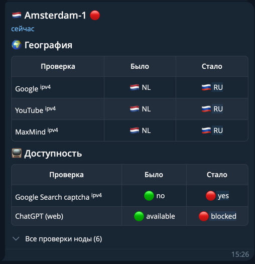

# geo-watcher

Monitor how external services see your Remnawave nodes and get notified when
their geography or availability changes.

geo-watcher runs Remnawave's built-in
[geocheck](https://github.com/remnawave/geocheck) on every active node, compares
the results with the previous run, and sends only the changes to Telegram.



## Requirements

| Component | Requirement |
| --- | --- |
| Remnawave | Panel 3.3.0+|
| Python | Python 3.12+ |

### API token permissions

Open **Remnawave Settings → API Tokens** in the panel. For least-privilege
access, create a token with these endpoint scopes:

- `nodes:list` — list nodes and select those that are connected and enabled;
- `connections:geocheck` — start a geocheck job on a node;
- `connections:geocheck-result` — poll the job until its result is ready.

Alternatively, grant the broader `nodes:read` and `connections:read` scopes.
geo-watcher does not require any write scopes.

## Quick start

1. Prepare the deployment files using either method:

   - Clone the repository and create the configuration file:

     ```bash
     git clone https://github.com/zen220/geo-watcher.git
     cd geo-watcher
     cp config.example.toml config.toml
     ```

   - Or create a directory manually, copy the contents of
     [`docker-compose.yml`](docker-compose.yml) into a file with the same name,
     and paste the contents of
     [`config.example.toml`](config.example.toml) into `config.toml`.

2. Set your Remnawave credentials and, if needed, Telegram settings in
   `config.toml`.

3. Pull and start the watcher:

   ```bash
   docker compose pull
   docker compose up -d
   ```

## Configuration

geo-watcher reads `config.toml` from the current directory by default. A full
configuration looks like this:

```toml
[remnawave]
base_url = "https://your-remnawave-panel.com"
token = "your-api-token-here"

[telegram]
bot_token = "1234567890:ABCDEFGHIJKLMNOPQRSTUVWXYZ"
chat_id = 123456789
custom_emoji = true
message_thread_id = 42

[watcher]
interval = 3600
sources = ["services", "geoip", "stash"]
state_file = "state.json"

[logging]
level = 20
format = "[%(levelname)s] %(asctime)s - %(name)s - %(message)s"
```

### Remnawave

| Option | Required | Description |
| --- | --- | --- |
| `base_url` | Yes | Base URL of the Remnawave panel. |
| `token` | Yes | Bearer API token with the [required scopes](#api-token-permissions). |

### Telegram

The entire `[telegram]` section is optional. If it is omitted, the watcher
still runs and logs detected changes without sending notifications.

| Option | Default | Description |
| --- | --- | --- |
| `bot_token` | Required | Token issued by BotFather. |
| `chat_id` | Required | Numeric chat ID or a channel username such as `"@channel"`. |
| `message_thread_id` | None | Forum topic ID for notifications. |
| `custom_emoji` | `true` | Use custom Telegram emoji; set to `false` to use standard emoji fallbacks. |

The bot must be able to post in the configured chat. Custom emoji may require
Telegram Premium on the account that owns the bot.

### Watcher

| Option | Default | Description |
| --- | --- | --- |
| `interval` | `3600` | Delay between runs, in seconds. |
| `sources` | `services`, `geoip`, `stash` | Report sections from geocheck to monitor. |
| `state_file` | `state.json` | File containing the latest known value of every check. Relative paths are resolved from the working directory. |

Supported sources:

| Source | What it contains |
| --- | --- |
| `services` | Country, availability, and blocking results reported by services. |
| `geoip` | Country results from GeoIP providers. |
| `cdn` | Country results reported by CDN endpoints. |
| `stash` | Availability and regional access checks from the geocheck stash. |

### Logging

| Option | Default | Description |
| --- | --- | --- |
| `level` | `20` | Standard Python logging level (`10` for DEBUG, `20` for INFO, `30` for WARNING). |
| `format` | See example | Python logging format string. |

## CLI

```text
usage: geo-watcher [-h] [--config PATH] [--once] [--version]

options:
  -h, --help     show this help message and exit
  --config PATH  path to the TOML config (default: config.toml)
  --once         run a single pass and exit instead of looping forever
  --version      show program's version number and exit
```

Use a configuration file from another location:

```bash
geo-watcher --config /etc/geo-watcher/prod.toml
```

Run a single pass for cron, a systemd timer, or manual testing:

```bash
geo-watcher --once
```

Without `--once`, the watcher runs immediately and then repeats after every
configured interval.
